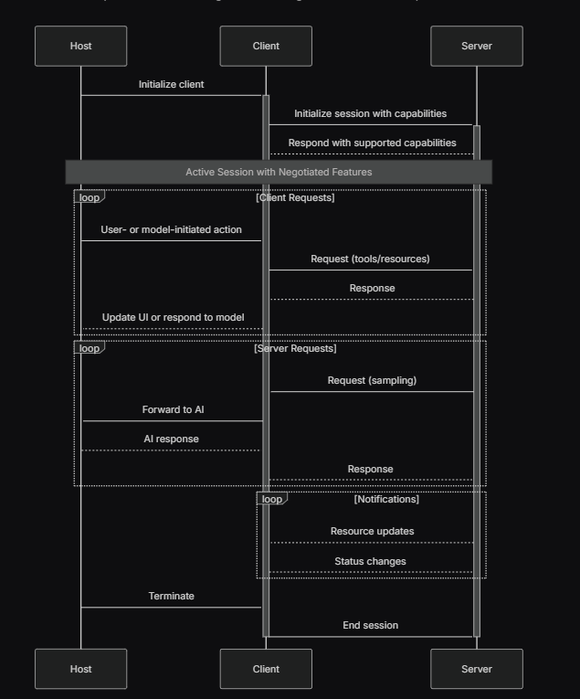

This project implements an AI agent capable of engaging in conversational interactions, performing web searches, and managing its memory using the Mem0 platform. The agent communicates with a custom server for tool execution and leverages the Groq API for its language model capabilities.

## Introduction to Model Context Protocol (MCP)

The Model Context Protocol (MCP) is an open standard framework designed to standardize how AI systems, particularly large language models (LLMs), integrate and share data with external tools, systems, and data sources. Introduced by Anthropic in November 2024, MCP aims to address the challenge of information silos and the need for custom connectors for each data source or tool, providing a universal interface for AI applications to access external capabilities. Think of MCP as a "USB-C port for AI applications," offering a standardized way to connect AI models to various data sources and tools. It's not an agent framework itself, but rather a standardized integration layer for agents accessing tools.

### Core Architecture



### MCP Transport Layer

The transport layer handles the actual communication between clients and servers. MCP supports multiple transport mechanisms, all of which use JSON-RPC 2.0 as their wire format for exchanging messages. The transport layer is responsible for converting MCP protocol messages into JSON-RPC format for transmission and converting received JSON-RPC messages back into MCP protocol messages.

#### Built-in Transport Types

MCP currently defines two standard transport mechanisms:

*   **Standard Input/Output (stdio) Transport**: This transport enables communication through standard input and output streams. It is particularly useful for local integrations and command-line tools, offering efficiency for same-machine communication and simple process management.
    *   **Use stdio when:**
        *   Building command-line tools
        *   Implementing local integrations
        *   Needing simple process communication
        *   Working with shell scripts

*   **Streamable HTTP Transport**: This transport uses HTTP POST requests for client-to-server communication and optional Server-Sent Events (SSE) streams for server-to-client communication. It is the recommended transport mechanism for web-based MCP applications, providing a modern and flexible transport layer that supports both batch responses and streaming.
    *   **How it Works:**
        *   **Client-to-Server Communication:** Every JSON-RPC message from client to server is sent as a new HTTP POST request to the MCP endpoint.
        *   **Server Responses:** The server can respond either with a single JSON response (`Content-Type: application/json`) or an SSE stream (`Content-Type: text/event-stream`) for multiple messages.
        *   **Server-to-Client Communication:** Servers can send requests/notifications to clients via SSE streams initiated by client requests or SSE streams from HTTP GET requests to the MCP endpoint.
    *   **Use Streamable HTTP when:**
        *   Building web-based integrations
        *   Needing client-server communication over HTTP
        *   Requiring stateful sessions
        *   Supporting multiple concurrent clients
        *   Implementing resumable connections

### MCP Message Flow


### Stateful vs. Stateless Communication

The project prototype utilizes a "stateful" approach, meaning it maintains an open session. To understand this, it's important to differentiate between stateful and stateless protocols:

*   **Stateless Protocol**: In a stateless protocol, each request from a client to a server is treated as an independent transaction, completely unrelated to any previous requests. The server does not retain any information about past client interactions. This simplifies server design and optimizes resource utilization, making it suitable for brief and intermittent communications. Examples include HTTP and UDP.
*   **Stateful Protocol**: In contrast, a stateful protocol maintains session information, meaning the server keeps track of the state and context of ongoing interactions with a client. This allows for more consistent and continuous interaction, as subsequent requests can be processed in the context of earlier ones. While more complex to implement, stateful protocols provide robust and reliable communication by maintaining session states. Examples include FTP and TCP.

In the context of this project, using a stateful approach by opening a session allows the AI agent to maintain conversational context and user-specific information across turns and sessions, which is crucial for its memory management capabilities.

## Project Overview

The core of this project is an AI assistant named **Memoria**. It is designed to:
- Understand user queries and intent.
- Utilize external tools (like web search and memory management) to fulfill requests.
- Maintain conversational context and user-specific information across turns and sessions.
- Operate in a step-by-step, autonomous manner, deciding its own actions based on the conversation.

## `server.py` (MCP Tool Server)

This Python file acts as the backend server for the agent, exposing various tools via the MCP (Model Context Protocol) framework. It handles requests from the `client.py` to execute specific functionalities.

### Key Tools Provided:
- **`web_search`**: Performs web searches using the Tavily API to retrieve information.
- **`add_short_memory`**: Stores conversational context and ephemeral facts for the current session using Mem0.
- **`add_longterm_memory`**: Stores critical, long-lasting facts and user preferences using Mem0.
- **`get_memories`**: Retrieves memories associated with a specific user ID from Mem0.
- **`search_memories_v2`**: Advanced search functionality for memories.
- **`memory_history`**: Retrieves the history of memory operations.
- **`get_memory`**: Retrieves a specific memory by ID.
- **`update_memory`**: Modifies existing memories in Mem0.
- **`delete_memory`**: Removes memories from Mem0.

## `client.py` (Memoria AI Agent)

This Python file is the main client-side application that runs the Memoria AI agent. It orchestrates the conversation flow, interacts with the Groq API for AI reasoning, and calls tools exposed by the `server.py`.

### Key Components:
- **`chat_loop()`**: The main asynchronous function that initializes the MCP client, fetches available tools, sets up the Groq client, and manages the interactive chat session. It continuously takes user input and passes it to `run_agent_turn`.
- **`run_agent_turn()`**: The core agent logic. This function handles a single turn of the agent's reasoning. It iteratively communicates with the Groq AI model, executes tools (via `mcp_client.call_tool`), and feeds the results back to the AI until a final natural language response is generated. It includes robust error handling and a safeguard for injecting `session_run_id` into memory operations.

### Agent's Reasoning Process (System Prompt):
Memoria operates based on a sophisticated system prompt that guides its behavior:
1.  **Analyze User Intent:** Understands what the user wants.
2.  **Formulate a Plan:** Creates a step-by-step plan of single actions.
3.  **Select One Tool:** Chooses the best tool for the current step.
4.  **Execute & Re-evaluate:** Runs the tool, processes results, and decides the next action.
5.  **Remember (Final Step):** Calls `add_short_memory` to save conversational context before responding.

### User Identification & Memory Strategy:
-   Uses provided `user_id` if available.
-   Defaults to `user-anonymous` for unnamed users.
-   Utilizes `add_short_memory` for session context and `add_longterm_memory` for critical, persistent facts.

## Setup and Installation

This project requires **Python 3.9+**.

To get started, follow these steps in your terminal:

```bash
# 1. Clone the repository
git clone <repository_url>
cd MCP-HTTP_Streaming

# 2. Install uv (a fast Python package installer and manager)
# If you don't have pip, install Python first from python.org
pip install uv

# 3. Create a virtual environment using uv
uv venv

# 4. Activate the virtual environment
# On Windows:
.venv\Scripts\activate
# On macOS/Linux:
source .venv/bin/activate

# 5. Create a requirements.txt file in your project root
# Add the following content to requirements.txt:
# fastmcp
# groq
# loguru
# mem0
# tavily-python

# 6. Install dependencies using uv pip install
uv pip install -r requirements.txt
```

### Configure API Keys and Environment Variables

Create a `configs` directory in the root of your project, and inside it, create a `config.py` file. This file should contain your API keys and server URLs:

```python
# configs/config.py
GROQ_API_KEY = "your_groq_api_key_here"
MODEL_NAME = "llama3-8b-8192" # Or your preferred Groq model
MCP_SERVER_URL = "http://127.0.0.1:8000/mcp/"
MEM0_API_KEY = "your_mem0_api_key_here"
TAVILY_API_KEY = "your_tavily_api_key_here"
```

## How to Run

1.  **Start the MCP Server:**
    Open a new terminal, activate your virtual environment, and run the `server.py`:
    ```bash
    python server.py
    ```
    Ensure the server starts successfully and is listening on `http://127.0.0.1:8000/mcp/`.

2.  **Start the Memoria AI Agent:**
    Open another terminal, activate your virtual environment, and run the `client.py`:
    ```bash
    python client.py
    ```

3.  **Interact with the Agent:**
    You can now type your queries in the client terminal. The agent will use its reasoning process and available tools to respond.


